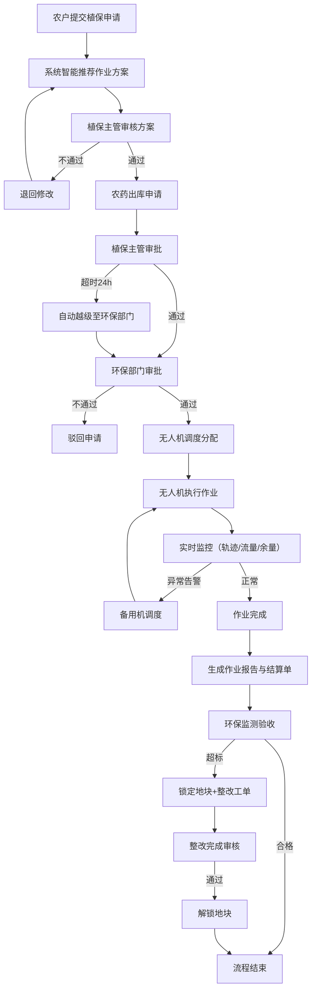
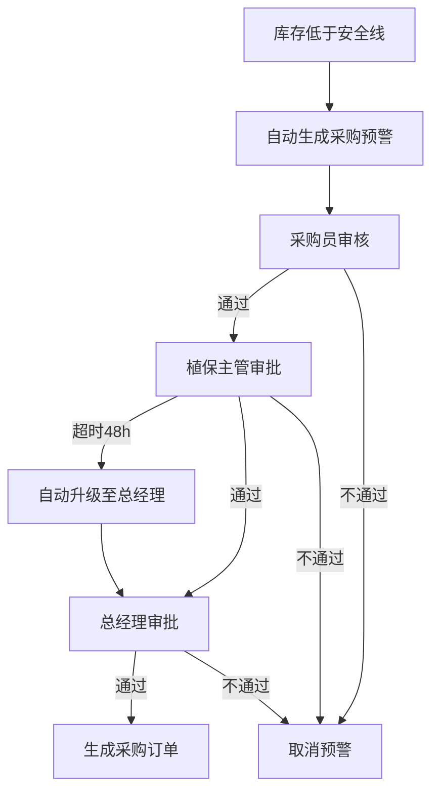

# 智慧农业无人机植保调度与农药监管平台 产品需求文档

## 1. 产品概述

智慧农业无人机植保调度与农药监管平台是整合农户需求、植保服务商、无人机设备、农药库存及环保监测全链路的一体化管理平台。平台通过智能化调度算法、实时监控系统和多级审批机制，实现植保作业全流程数字化管控，提升农业生产效率，保障农药使用安全，保护生态环境。

### 1.1 产品目标
- 实现植保作业全流程数字化、智能化管理
- 优化无人机调度效率，降低作业成本
- 规范农药使用与审批流程，保障用药安全
- 实时环保监测，防止农业面源污染
- 提供数据可视化大屏，支撑管理决策

### 1.2 目标用户
- 农户：提交植保申请，查看作业进度与报告
- 飞手：接收作业任务，执行植保飞行
- 植保主管：区域植保管理，审批农药出库
- 环保监管人员：监测环境数据，处理超标告警
- 系统管理员：全局配置，调度规则管理

## 2. 核心功能

### 2.1 用户角色与权限

| 角色 | 登录方式 | 核心权限 |
|------|----------|----------|
| 农户 | 账号密码登录 | 提交植保申请、查看本人地块、查看作业报告、接收整改通知 |
| 飞手 | 账号密码登录 | 查看分配任务、执行作业、上报作业数据、查看飞行轨迹 |
| 植保主管 | 账号密码登录 | 管理本区域植保任务、审批农药出库、审核作业方案、查看库存 |
| 环保监管人员 | 账号密码登录 | 查看环保监测数据、处理超标告警、查看整改工单、锁定违规地块 |
| 管理员 | 账号密码登录 | 用户管理、权限配置、调度规则设置、审批阈值调整、数据导出 |

### 2.2 功能模块总览

1. **首页大屏**：数据可视化看板，实时展示全局运行状态
2. **植保申请管理**：农户提交申请，系统智能推荐作业方案
3. **无人机调度监控**：实时无人机状态、飞行轨迹、喷洒监控
4. **农药库存管理**：库存台账、出入库管理、采购预警、多级审批
5. **环保监测**：水质土壤监测、超标告警、整改工单
6. **作业报告与结算**：自动生成作业报告、农药用量结算
7. **系统管理**：用户管理、权限配置、规则设置

### 2.3 页面详情

| 页面名称 | 模块名称 | 功能描述 |
|----------|----------|----------|
| 登录页 | 身份认证 | 账号密码登录、角色选择、记住登录状态 |
| 首页大屏 | 数据概览 | 无人机状态分布、今日作业面积、农药库存周转率、环保告警趋势、农户满意度 |
| 首页大屏 | 筛选控制 | 按区域、作物类型、日期组合筛选，数据每5秒刷新 |
| 首页大屏 | 报告导出 | 一键导出月度植保作业分析报告与农药使用明细 |
| 植保申请 | 申请列表 | 查看所有植保申请，支持多条件筛选 |
| 植保申请 | 新建申请 | 农户提交地块信息、作物类型、植保需求 |
| 植保申请 | 方案推荐 | 系统根据地块、作物、病虫害自动推荐最优作业方案与农药配方 |
| 植保申请 | 方案审核 | 植保主管审核作业方案，调整农药配比 |
| 无人机监控 | 状态总览 | 所有无人机实时状态、位置、电量、任务状态 |
| 无人机监控 | 实时轨迹 | 无人机飞行轨迹回放、喷洒流量、药液余量实时显示 |
| 无人机监控 | 告警中心 | 航线偏移、药量不足告警，自动触发备用机调度 |
| 农药库存 | 库存台账 | 农药分类管理、库存数量、有效期、批次追溯 |
| 农药库存 | 出库审批 | 植保主管+环保部门两级审批，超24小时自动越级 |
| 农药库存 | 采购预警 | 库存低于安全线自动预警，触发采购员→主管→总经理三级审批 |
| 环保监测 | 实时监测 | 作业区水质、土壤残留实时数据展示 |
| 环保监测 | 超标告警 | 超标自动锁定地块、暂停作业、生成整改工单 |
| 环保监测 | 整改管理 | 整改工单推送、整改审核、地块解锁 |
| 作业报告 | 报告列表 | 所有作业报告列表，支持筛选查询 |
| 作业报告 | 报告详情 | 作业时间、面积、农药用量、作业效果评估 |
| 作业报告 | 结算单 | 自动生成农药用量结算单，支持导出 |
| 系统管理 | 用户管理 | 用户增删改查、角色分配 |
| 系统管理 | 权限配置 | 五级权限精细化配置 |
| 系统管理 | 规则配置 | 调度规则、审批阈值、告警阈值设置 |

## 3. 核心业务流程

### 3.1 植保作业全流程

农户提交植保申请 → 系统智能推荐作业方案 → 植保主管审核方案 → 农药出库两级审批 → 无人机调度与作业 → 实时监控与告警 → 作业完成生成报告 → 结算单生成 → 环保监测验收

### 3.2 业务流程图

### 3.3 农药采购审批流程

库存低于安全线 → 自动生成采购预警 → 采购员审核 → 植保主管审批 → 总经理审批 → 超48小时自动升级

## 4. 用户界面设计

### 4.1 设计风格

- **主色调**：深绿色（#1B5E20）代表农业与环保，科技蓝（#0288D1）代表智能科技
- **辅助色**：橙色（#FF8F00）用于告警提示，绿色（#4CAF50）用于正常状态，红色（#F44336）用于危险状态
- **背景**：深色科技风，深蓝灰色调背景，营造专业监控大屏氛围
- **按钮风格**：圆角矩形，微立体效果，hover时有颜色渐变
- **字体**：思源黑体 + JetBrains Mono（数据展示）
- **布局风格**：卡片式布局，网格化排列，信息层级分明
- **图标风格**：线性图标，统一风格，与配色协调
- **动效**：数据刷新有数字滚动动画，告警有呼吸灯效果

### 4.2 页面设计概览

| 页面名称 | 模块名称 | UI设计要点 |
|----------|----------|------------|
| 登录页 | 登录表单 | 左侧品牌展示区（农业科技插画），右侧登录表单，渐变背景 |
| 首页大屏 | 顶部导航 | 深色导航栏，logo+系统名称，用户信息与角色切换 |
| 首页大屏 | 数据看板 | 6大核心指标卡片（数字滚动动画），中间地图区域，下方趋势图表 |
| 首页大屏 | 实时数据 | 数据每5秒刷新，有刷新动效提示 |
| 植保申请 | 列表页 | 表格+筛选栏，状态标签颜色区分，操作列按钮组 |
| 植保申请 | 详情页 | 左右分栏，左侧基本信息，右侧方案推荐与审批流程 |
| 无人机监控 | 监控大屏 | 地图为主视图，侧边无人机列表，底部实时数据面板 |
| 无人机监控 | 轨迹回放 | 时间轴控制，播放/暂停，速度调节 |
| 农药库存 | 库存看板 | 分类统计卡片，库存预警列表，出入库记录表格 |
| 农药库存 | 审批流 | 审批流程图，当前节点高亮，审批意见输入框 |
| 环保监测 | 监测大屏 | 地图标色（正常/超标），实时数据仪表，告警列表 |
| 作业报告 | 报告详情 | 报告头部信息，作业数据图表，农药使用明细，附件下载 |
| 系统管理 | 用户管理 | 用户列表，角色标签，启用/禁用开关，批量操作 |

### 4.3 响应式设计

- **设计原则**：Desktop-first，兼顾大屏展示与平板访问
- **断点设置**：1920px（大屏最优）、1440px（标准桌面）、1024px（平板横屏）
- **大屏适配**：首页大屏支持全屏展示，适合指挥中心大屏投屏
- **移动端**：简化展示，核心功能可用，不做复杂交互

### 4.4 数据可视化设计

- **地图组件**：区域地块分布，无人机位置实时标注，环保监测点热力图
- **图表类型**：折线图（趋势）、柱状图（对比）、饼图（占比）、仪表盘（阈值）
- **动画效果**：数据加载渐入，数字滚动计数，图表平滑过渡
- **告警提示**：红色呼吸灯效果，声音提醒（可关闭），弹出通知

## 5. 非功能性需求

### 5.1 性能要求
- 首页大屏数据刷新间隔：5秒
- 无人机位置更新频率：1秒
- 页面首屏加载时间：< 3秒
- 支持并发在线用户数：500+

### 5.2 安全要求
- 用户密码加密存储
- 操作日志完整记录
- 敏感数据脱敏展示
- 权限精细化控制

### 5.3 可用性要求
- 系统可用性：99.5%以上
- 数据备份：每日自动备份
- 异常告警：系统故障及时通知管理员
