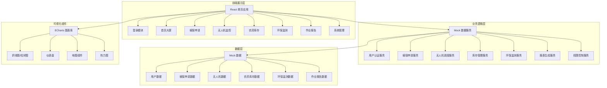
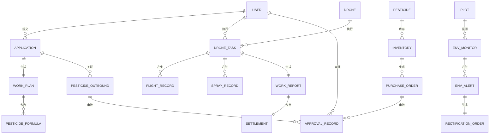

# 智慧农业无人机植保监管平台 技术架构文档

## 1. 架构设计

### 1.1 系统架构图



## 2. 技术栈说明

### 2.1 前端技术栈
- **框架**: React 18 + TypeScript
- **构建工具**: Vite 5
- **UI 组件库**: Ant Design 5
- **样式方案**: TailwindCSS 3 + CSS Modules
- **状态管理**: Zustand
- **路由**: React Router v6
- **图表库**: ECharts 5 + echarts-for-react
- **地图**: 简易 SVG 地图（模拟）
- **图标**: @ant-design/icons + Lucide React
- **动画**: Framer Motion
- **工具库**: dayjs, lodash, classnames

### 2.2 数据方案
- **数据方式**: Mock 数据（前端模拟）
- **数据生成**: 使用预设数据 + 随机生成模拟实时数据
- **数据刷新**: setInterval 模拟实时数据更新

### 2.3 开发规范
- **代码规范**: ESLint + Prettier
- **提交规范**: 遵循 Conventional Commits
- **目录结构**: 按功能模块组织

## 3. 路由定义

| 路由路径 | 页面名称 | 访问权限 | 说明 |
|----------|----------|----------|------|
| /login | 登录页 | 公开 | 用户登录、角色选择 |
| /dashboard | 首页大屏 | 所有登录用户 | 数据可视化看板，按角色过滤数据 |
| /applications | 植保申请列表 | 农户/植保主管 | 植保申请管理 |
| /applications/new | 新建植保申请 | 农户 | 提交新的植保申请 |
| /applications/:id | 植保申请详情 | 农户/植保主管 | 申请详情与方案审核 |
| /drones | 无人机监控 | 飞手/植保主管/管理员 | 无人机实时监控大屏 |
| /drones/:id | 无人机详情 | 飞手/植保主管 | 单架无人机详情与轨迹 |
| /inventory | 农药库存 | 植保主管/管理员 | 库存台账管理 |
| /inventory/approvals | 出库审批 | 植保主管/环保人员 | 农药出库审批流程 |
| /inventory/purchase | 采购审批 | 采购员/主管/总经理 | 采购申请审批 |
| /environment | 环保监测 | 环保人员/管理员 | 环保监测大屏 |
| /environment/alerts | 告警管理 | 环保人员 | 超标告警与整改工单 |
| /reports | 作业报告 | 农户/植保主管/管理员 | 作业报告列表 |
| /reports/:id | 报告详情 | 农户/植保主管 | 报告详情与结算单 |
| /system/users | 用户管理 | 管理员 | 用户与权限管理 |
| /system/settings | 系统设置 | 管理员 | 调度规则与阈值配置 |

## 4. 目录结构

```
src/
├── assets/              # 静态资源
│   ├── images/
│   └── styles/
├── components/          # 公共组件
│   ├── Layout/          # 布局组件
│   ├── Charts/          # 图表组件
│   ├── StatusBadge/     # 状态标签
│   ├── DataCard/        # 数据卡片
│   └── Table/           # 表格组件
├── pages/               # 页面组件
│   ├── Login/
│   ├── Dashboard/
│   ├── Applications/
│   ├── Drones/
│   ├── Inventory/
│   ├── Environment/
│   ├── Reports/
│   └── System/
├── store/               # 状态管理
│   ├── useAuthStore.ts
│   ├── useDashboardStore.ts
│   └── ...
├── mock/                # Mock 数据
│   ├── users.ts
│   ├── applications.ts
│   ├── drones.ts
│   ├── inventory.ts
│   ├── environment.ts
│   └── reports.ts
├── services/            # 服务层（封装数据访问）
│   ├── authService.ts
│   ├── applicationService.ts
│   └── ...
├── types/               # TypeScript 类型定义
│   ├── index.ts
│   ├── user.ts
│   ├── application.ts
│   └── ...
├── utils/               # 工具函数
│   ├── format.ts
│   ├── date.ts
│   └── permission.ts
├── hooks/               # 自定义 Hooks
│   ├── usePermission.ts
│   ├── useRealTimeData.ts
│   └── ...
├── router/              # 路由配置
│   └── index.tsx
├── App.tsx
└── main.tsx
```

## 5. 数据模型

### 5.1 数据模型 ER 图



### 5.2 核心数据结构定义

#### 用户 (User)
```typescript
interface User {
  id: string;
  username: string;
  name: string;
  role: 'farmer' | 'pilot' | 'supervisor' | 'env_officer' | 'admin';
  phone: string;
  email: string;
  avatar?: string;
  region?: string;
  status: 'active' | 'inactive';
  createdAt: string;
}
```

#### 植保申请 (Application)
```typescript
interface Application {
  id: string;
  farmerId: string;
  farmerName: string;
  plotId: string;
  plotName: string;
  plotArea: number; // 亩
  cropType: string;
  cropStage: string;
  pestType: string;
  pestLevel: 'mild' | 'moderate' | 'severe';
  requirement: string;
  expectedDate: string;
  status: 'pending' | 'planning' | 'approved' | 'rejected' | 'in_progress' | 'completed';
  workPlan?: WorkPlan;
  createdAt: string;
}
```

#### 作业方案 (WorkPlan)
```typescript
interface WorkPlan {
  id: string;
  applicationId: string;
  droneIds: string[];
  pilotIds: string[];
  scheduledDate: string;
  estimatedDuration: number; // 分钟
  estimatedArea: number;
  flightHeight: number;
  sprayVolume: number; // 升/亩
  formulas: PesticideFormula[];
  totalCost: number;
  status: 'pending' | 'approved' | 'rejected';
  supervisorOpinion?: string;
}
```

#### 农药配方 (PesticideFormula)
```typescript
interface PesticideFormula {
  pesticideId: string;
  pesticideName: string;
  dosage: number; // 克/亩 或 毫升/亩
  unit: 'g' | 'ml';
  price: number;
  totalAmount: number;
}
```

#### 无人机 (Drone)
```typescript
interface Drone {
  id: string;
  name: string;
  model: string;
  status: 'idle' | 'in_task' | 'charging' | 'maintenance' | 'offline';
  battery: number; // 百分比
  currentLocation: { lat: number; lng: number };
  tankCapacity: number; // 升
  currentLiquid: number; // 升
  sprayRate: number; // 升/分钟
  maxPayload: number; // 公斤
  flightRange: number; // 公里
  pilotId?: string;
  currentTaskId?: string;
  lastMaintenanceDate: string;
}
```

#### 农药库存 (Inventory)
```typescript
interface Inventory {
  id: string;
  pesticideId: string;
  pesticideName: string;
  category: 'insecticide' | 'fungicide' | 'herbicide' | 'other';
  specification: string;
  unit: 'kg' | 'L' | 'box' | 'bottle';
  totalQuantity: number;
  availableQuantity: number;
  reservedQuantity: number;
  safetyStock: number;
  unitPrice: number;
  supplier: string;
  productionDate: string;
  expiryDate: string;
  batchNumber: string;
  warehouse: string;
  status: 'normal' | 'warning' | 'shortage';
}
```

#### 环保监测 (EnvironmentMonitor)
```typescript
interface EnvironmentMonitor {
  id: string;
  plotId: string;
  plotName: string;
  monitorTime: string;
  waterQuality: {
    ph: number;
    dissolvedOxygen: number;
    pesticideResidue: number;
    nitrite: number;
  };
  soilQuality: {
    ph: number;
    organicMatter: number;
    pesticideResidue: number;
    heavyMetals: number;
  };
  status: 'normal' | 'warning' | 'exceeded';
}
```

#### 作业报告 (WorkReport)
```typescript
interface WorkReport {
  id: string;
  applicationId: string;
  taskId: string;
  plotName: string;
  farmerName: string;
  droneIds: string[];
  pilotNames: string[];
  startTime: string;
  endTime: string;
  actualArea: number;
  flightDuration: number;
  totalSprayVolume: number;
  pesticideUsage: { name: string; amount: number; unit: string }[];
  flightTrajectory: { lat: number; lng: number; time: string }[];
  effectEvaluation: string;
  settlement: Settlement;
  status: 'draft' | 'confirmed';
}
```

## 6. 核心模块设计

### 6.1 权限控制系统
- 基于角色的访问控制 (RBAC)
- 路由级权限校验
- 组件级权限控制（按钮、菜单）
- 数据级权限过滤（农户只能看自己的）

### 6.2 实时数据模拟
- 5秒定时刷新大屏数据
- 无人机位置模拟移动
- 随机生成告警数据
- 数据变化带动画效果

### 6.3 审批流程
- 两级审批：植保主管 → 环保部门
- 超时自动越级机制（24小时）
- 三级采购审批：采购员 → 主管 → 总经理
- 超时自动升级（48小时）
- 审批流程可视化展示

## 7. 性能优化

### 7.1 前端优化
- 路由懒加载
- 组件按需引入
- 图表按需渲染
- 虚拟滚动（大数据列表）
- 防抖节流处理

### 7.2 构建优化
- Vite 构建优化
- 代码分割
- 资源预加载
- Tree Shaking
